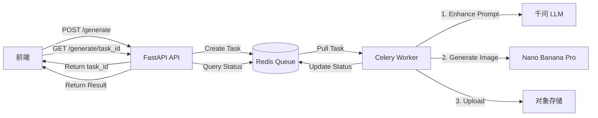
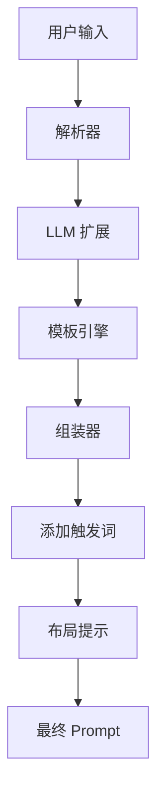

# Nano Flow 后端 API 设计方案

## 一、核心 API 接口列表

基于前端代码 [`fronted/nano-flow/src/App.tsx`](fronted/nano-flow/src/App.tsx) 和 PRD 文档 [`Nano_Flow_PRD.md`](Nano_Flow_PRD.md)，需要实现以下 REST API 端点：

### 1.1 项目生成相关

#### **POST /api/v1/generate**

生成流程图的主接口

**Request Body:**

```json
{
  "title": "如何制作美味拿铁",
  "steps": [
    {
      "title": "研磨咖啡豆",
      "description": "选择新鲜的中深烘焙豆子"
    },
    {
      "title": "萃取浓缩",
      "description": "使用咖啡机萃取双份Espresso"
    }
  ],
  "visual_preferences": {
    "character": "bear",  // bear, cat, rabbit, random
    "color_scheme": "pastel",  // pastel, tech_blue, warm_orange
    "custom_tags": ["kawaii", "flat"]
  },
  "seed": null  // optional, for regeneration
}
```

**Response:**

```json
{
  "task_id": "uuid-xxx-xxx",
  "status": "processing",
  "message": "正在分析需求... 🧠"
}
```

---

#### **GET /api/v1/generate/{task_id}**

轮询查询生成任务状态

**Response (Processing):**

```json
{
  "task_id": "uuid-xxx",
  "status": "processing",
  "progress": 45,
  "message": "正在给线条上色... 🎨",
  "estimated_time": 30
}
```

**Response (Success):**

```json
{
  "task_id": "uuid-xxx",
  "status": "completed",
  "result": {
    "image_url": "https://cdn.example.com/images/xxx.png",
    "thumbnail_url": "https://cdn.example.com/images/xxx_thumb.png",
    "enhanced_prompt": "A cute white bear with magnifying glass reading a book, kawaii layout, infographic style...",
    "metadata": {
      "resolution": "1920x1080",
      "seed": 42,
      "model_version": "nano-banana-pro-v1"
    }
  }
}
```

**Response (Failed):**

```json
{
  "task_id": "uuid-xxx",
  "status": "failed",
  "error": {
    "code": "MODEL_TIMEOUT",
    "message": "图像生成超时，请重试"
  }
}
```

---

### 1.2 智能填充功能

#### **POST /api/v1/smart-fill**

AI 智能填充步骤内容（对应前端的 Smart Fill 按钮）

**Request Body:**

```json
{
  "topic": "拿铁咖啡制作",
  "step_count": 4,
  "language": "zh"
}
```

**Response:**

```json
{
  "title": "如何制作美味拿铁",
  "steps": [
    {
      "title": "研磨咖啡豆",
      "description": "选择新鲜的中深烘焙豆子"
    },
    {
      "title": "萃取浓缩",
      "description": "使用咖啡机萃取双份Espresso"
    }
  ]
}
```

---

### 1.3 提示词管理（Debug 模式）

#### **POST /api/v1/prompt/enhance**

增强提示词（供高级用户手动编辑前预览）

**Request Body:**

```json
{
  "title": "产品开发流程",
  "steps": [...],
  "visual_preferences": {...}
}
```

**Response:**

```json
{
  "enhanced_prompt": "Full detailed prompt for Nano Banana Pro...",
  "tokens_used": 256,
  "llm_model": "qwen-turbo"
}
```

---

#### **POST /api/v1/generate/custom-prompt**

使用用户自定义的提示词直接生成

**Request Body:**

```json
{
  "custom_prompt": "User's manually edited prompt...",
  "image_config": {
    "resolution": "1920x1080",
    "seed": 42
  }
}
```

**Response:** 同 `/api/v1/generate` 返回格式

---

### 1.4 结果管理

#### **GET /api/v1/download/{task_id}**

下载生成的图片

**Query Parameters:**

- `format`: png / jpg (default: png)
- `quality`: 80-100 (for jpg only)

**Response:** 二进制图片流 (Content-Type: image/png)

---

#### **POST /api/v1/regenerate/{task_id}**

基于已有任务重新生成（刷新随机种子）

**Request Body:**

```json
{
  "keep_prompt": true,
  "new_seed": null  // null = random
}
```

**Response:** 同 `/api/v1/generate`

---

### 1.5 历史记录（可选 P1 功能）

#### **GET /api/v1/history**

获取用户生成历史

**Query Parameters:**

- `page`: 1
- `limit`: 20

**Response:**

```json
{
  "items": [
    {
      "task_id": "xxx",
      "title": "产品开发流程",
      "thumbnail_url": "...",
      "created_at": "2026-01-23T10:30:00Z"
    }
  ],
  "total": 45,
  "page": 1,
  "limit": 20
}
```

---

## 二、FastAPI 项目目录结构

```
backend/
├── app/
│   ├── __init__.py
│   ├── main.py                  # FastAPI 应用入口
│   ├── config.py                # 配置管理（环境变量、API密钥）
│   ├── dependencies.py          # 依赖注入（数据库会话、认证等）
│   │
│   ├── api/                     # API 路由层
│   │   ├── __init__.py
│   │   ├── v1/
│   │   │   ├── __init__.py
│   │   │   ├── generate.py      # 生成相关接口
│   │   │   ├── smart_fill.py    # 智能填充接口
│   │   │   ├── prompt.py        # 提示词管理接口
│   │   │   ├── download.py      # 下载接口
│   │   │   └── history.py       # 历史记录接口
│   │
│   ├── schemas/                 # Pydantic 数据模型
│   │   ├── __init__.py
│   │   ├── generate.py          # 生成请求/响应模型
│   │   ├── step.py              # 步骤模型
│   │   ├── visual.py            # 视觉偏好模型
│   │   ├── task.py              # 任务状态模型
│   │   └── prompt.py            # 提示词相关模型
│   │
│   ├── services/                # 业务逻辑层
│   │   ├── __init__.py
│   │   ├── prompt_builder.py    # 提示词构造器（核心 Brain）
│   │   ├── llm_service.py       # LLM 调用服务（千问等）
│   │   ├── image_generator.py   # Nano Banana Pro API 封装
│   │   ├── smart_fill_service.py # 智能填充逻辑
│   │   └── storage_service.py   # 图片存储服务（OSS/S3）
│   │
│   ├── models/                  # 数据库模型（SQLAlchemy）
│   │   ├── __init__.py
│   │   ├── task.py              # 任务表
│   │   └── generation_history.py # 生成历史表
│   │
│   ├── core/                    # 核心功能模块
│   │   ├── __init__.py
│   │   ├── celery_app.py        # Celery 异步任务配置
│   │   ├── redis_client.py      # Redis 连接
│   │   └── logger.py            # 日志配置
│   │
│   ├── tasks/                   # Celery 异步任务
│   │   ├── __init__.py
│   │   └── generation_tasks.py  # 图像生成异步任务
│   │
│   └── utils/                   # 工具函数
│       ├── __init__.py
│       ├── validators.py        # 输入验证
│       └── constants.py         # 常量定义
│
├── tests/                       # 测试目录
│   ├── __init__.py
│   ├── test_generate.py
│   └── test_prompt_builder.py
│
├── alembic/                     # 数据库迁移
│   ├── versions/
│   └── env.py
│
├── requirements.txt             # 依赖列表
├── .env.example                 # 环境变量示例
├── Dockerfile
├── docker-compose.yml
└── README.md
```

---

## 三、核心 Pydantic 数据模型 (Schemas)

### 3.1 步骤相关模型 (schemas/step.py)

```python
from pydantic import BaseModel, Field, validator

class StepInput(BaseModel):
    """用户输入的单个步骤"""
    title: str = Field(..., min_length=1, max_length=50, description="步骤标题")
    description: str = Field("", max_length=200, description="步骤描述")

class StepEnhanced(BaseModel):
    """LLM 增强后的步骤（包含视觉描述）"""
    title: str
    description: str
    visual_description: str = Field(..., description="AI 生成的视觉描述")
    icon_suggestion: str = Field(default="", description="建议的图标或角色")
```

### 3.2 视觉偏好模型 (schemas/visual.py)

```python
from enum import Enum
from pydantic import BaseModel
from typing import Optional, List

class CharacterType(str, Enum):
    BEAR = "bear"
    CAT = "cat"
    RABBIT = "rabbit"
    RANDOM = "random"

class ColorScheme(str, Enum):
    PASTEL = "pastel"
    TECH_BLUE = "tech_blue"
    WARM_ORANGE = "warm_orange"
    CUSTOM = "custom"

class VisualPreferences(BaseModel):
    """视觉偏好配置"""
    character: CharacterType = CharacterType.RANDOM
    color_scheme: ColorScheme = ColorScheme.PASTEL
    custom_tags: List[str] = Field(default_factory=list, max_length=10)
```

### 3.3 生成请求模型 (schemas/generate.py)

```python
from pydantic import BaseModel, Field, validator
from typing import List, Optional
from .step import StepInput
from .visual import VisualPreferences

class GenerateRequest(BaseModel):
    """图像生成请求"""
    title: str = Field(..., min_length=1, max_length=100, description="主标题")
    steps: List[StepInput] = Field(..., min_length=2, max_length=6, description="步骤列表")
    visual_preferences: VisualPreferences = Field(default_factory=VisualPreferences)
    seed: Optional[int] = Field(None, ge=0, description="随机种子（可选）")
    
    @validator('steps')
    def validate_steps_count(cls, v):
        if not (2 <= len(v) <= 6):
            raise ValueError('步骤数量必须在 2-6 之间')
        return v

class ImageMetadata(BaseModel):
    """生成图片的元数据"""
    resolution: str
    seed: int
    model_version: str
    cfg_scale: float = 7.0
    sampling_steps: int = 30

class GenerationResult(BaseModel):
    """生成结果"""
    image_url: str
    thumbnail_url: str
    enhanced_prompt: str
    metadata: ImageMetadata
```

### 3.4 任务状态模型 (schemas/task.py)

```python
from enum import Enum
from pydantic import BaseModel
from typing import Optional
from datetime import datetime

class TaskStatus(str, Enum):
    PENDING = "pending"
    PROCESSING = "processing"
    COMPLETED = "completed"
    FAILED = "failed"

class TaskResponse(BaseModel):
    """任务状态响应"""
    task_id: str
    status: TaskStatus
    progress: Optional[int] = Field(None, ge=0, le=100)
    message: str = ""
    result: Optional[GenerationResult] = None
    error: Optional[dict] = None
    estimated_time: Optional[int] = Field(None, description="预计剩余秒数")
    
class TaskCreate(BaseModel):
    """创建任务记录"""
    title: str
    input_data: dict
    user_id: Optional[str] = None
```

### 3.5 智能填充模型 (schemas/smart_fill.py)

```python
from pydantic import BaseModel, Field
from typing import List
from .step import StepInput

class SmartFillRequest(BaseModel):
    """智能填充请求"""
    topic: str = Field(..., min_length=2, max_length=100, description="主题")
    step_count: int = Field(4, ge=2, le=6, description="生成步骤数量")
    language: str = Field("zh", pattern="^(zh|en)$", description="语言")

class SmartFillResponse(BaseModel):
    """智能填充响应"""
    title: str
    steps: List[StepInput]
```

### 3.6 提示词模型 (schemas/prompt.py)

```python
from pydantic import BaseModel
from typing import Dict, Any

class PromptEnhanceRequest(BaseModel):
    """提示词增强请求"""
    title: str
    steps: List[StepInput]
    visual_preferences: VisualPreferences

class PromptEnhanceResponse(BaseModel):
    """提示词增强响应"""
    enhanced_prompt: str
    tokens_used: int
    llm_model: str
    breakdown: Dict[str, str] = Field(default_factory=dict, description="分段展示各部分提示词")

class CustomPromptRequest(BaseModel):
    """自定义提示词生成请求"""
    custom_prompt: str = Field(..., min_length=10, max_length=2000)
    image_config: Dict[str, Any] = Field(default_factory=dict)
```

---

## 四、关键技术架构设计

### 4.1 异步任务架构



**说明：**

- 使用 **Celery + Redis** 处理耗时的图像生成任务
- 前端通过轮询 (polling) 或 WebSocket 获取进度更新
- 任务状态存储在 Redis，结果 URL 持久化到数据库

### 4.2 提示词构造流程



**核心逻辑 (services/prompt_builder.py):**

1. **解析** 用户输入的标题和步骤
2. **LLM 调用** 将每个步骤扩展为视觉描述
3. **模板组装** 使用固定模板 + 动态内容
4. **触发词注入** 添加 `kawaii layout`, `infographic style`, `flat vector` 等关键词
5. **布局提示** 根据步骤数量决定 `horizontal timeline` 或 `grid layout`

### 4.3 数据库表设计

**tasks 表:**

| 字段 | 类型 | 说明 |

|------|------|------|

| id | UUID | 任务 ID |

| user_id | String | 用户标识 |

| title | String | 标题 |

| status | Enum | 状态 |

| input_data | JSON | 原始输入 |

| enhanced_prompt | Text | 增强后的提示词 |

| image_url | String | 结果图片 URL |

| error_message | Text | 错误信息 |

| created_at | DateTime | 创建时间 |

| completed_at | DateTime | 完成时间 |

---

## 五、技术栈依赖

**requirements.txt 核心依赖:**

```
fastapi==0.115.0
uvicorn[standard]==0.30.0
pydantic==2.9.0
pydantic-settings==2.5.0
sqlalchemy==2.0.36
alembic==1.14.0
celery==5.4.0
redis==5.2.0
httpx==0.27.0              # 调用外部 API
openai==1.54.0             # 千问 SDK（兼容 OpenAI 接口）
pillow==11.1.0             # 图片处理
python-multipart==0.0.12   # 文件上传
pyjwt==2.9.0               # JWT 认证
python-dotenv==1.0.1       # 环境变量
```

---

## 六、实施优先级

### P0（核心功能）

- ✅ `/api/v1/generate` - 基础生成接口
- ✅ `/api/v1/generate/{task_id}` - 状态查询
- ✅ `PromptBuilder` - 提示词构造器
- ✅ `LLMService` - 千问集成
- ✅ `ImageGenerator` - Nano Banana Pro 集成

### P1（增强体验）

- `/api/v1/smart-fill` - 智能填充
- `/api/v1/download/{task_id}` - 下载接